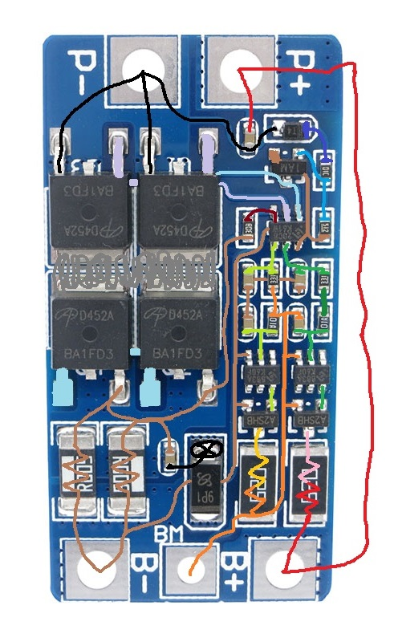
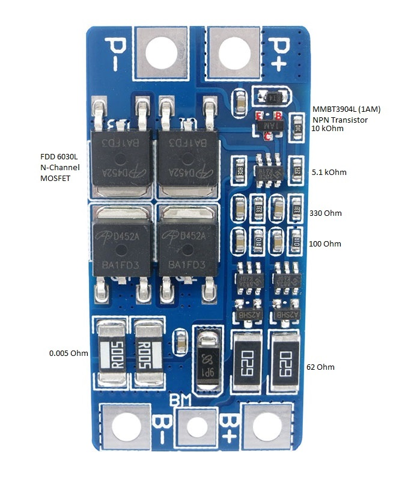

# HX-2S-JH20 reverse-engineered (2S-10A-Balance-Li-ion-Protection-PCB)

## Circuit trace:

## Components:

The circuit is based on the HYCON Technology Corp. HY2120-CB battery protection IC, and 2 HY2213-BB3A battery balancer ICs. Datasheets available here:

http://www.hycontek.com/wp-content/uploads/DS-HY2120_EN.pdf (marking: 20CB)
https://datasheet.lcsc.com/szlcsc/HY2213-BB3A_C113632.pdf (marking: BB3A)

These provide considerably more information about the board's functions than the description published on eBay and AliExpress listings.

The N-channel MOSFETs driven by the balancers appear to be HY2213 by H&M semiconductor, datasheet: https://www.mikrocontroller.net/attachment/212878/HM2302A.PDF (marking: A2SHB)

I have seen many vendors for the large MOSFETs driven by the protection circuit; at least Fairchild Semiconductor FDD6030L and Alpha & Omega AOD452 (in the picture) have been spotted.

Datasheets:

http://www.mouser.com/ds/2/149/FDD6030L-93158.pdf (marking: FDD6030L)
http://digichip.ru/datasheet/PDF/f30f381d7c1d5ae1ae42abdb5645a641/2c64c5cf613d8b9f4f7f3980d29aca10/AOD452.pdf (marking: D452A)

## Kicad Eeschema Schematic
### Work in Progress
[HX-2S-JH20 PDF](docs/HX_2S_JH20.pdf)
